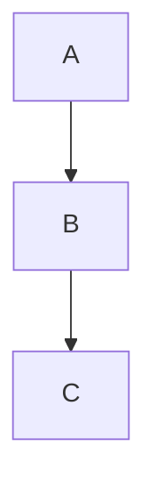

# just-the-docs: UI Components

Reference for Markdown syntax and just-the-docs-specific components available in page content.

## Callouts

Callouts must be [configured in `_config.yml`](./just-the-docs-config.md#callouts) before use.

### Single paragraph

```markdown
{: .note }
This is a note.
```

### Custom title

```markdown
{: .note-title }
> My custom title
>
> The note content here.
```

### Multiple paragraphs

```markdown
{: .warning }
> First paragraph.
>
> Second paragraph.
```

### Untitled (highlight only)

```markdown
{: .highlight }
This paragraph has a highlight background but no title label.
```

### Available callout names (this site)

This site does not yet define callout names — they must be added to `_config.yml` first. See [configuration reference](./just-the-docs-config.md#callouts) for the setup.

Recommended set to add:

```yaml
callouts:
  note:
    title: Note
    color: purple
  warning:
    title: Warning
    color: red
  important:
    title: Important
    color: blue
  new:
    title: New
    color: green
  highlight:
    color: yellow
```

## Tables

Standard Markdown pipe tables:

```markdown
| Column A | Column B | Column C |
| --- | --- | --- |
| Value 1 | Value 2 | Value 3 |
| Value 4 | Value 5 | Value 6 |
```

Alignment:

```markdown
| Left | Centre | Right |
| :--- | :---: | ---: |
| a | b | c |
```

just-the-docs automatically wraps tables in a scrollable container so they don't overflow on small screens.

## Code blocks

Fenced code blocks with a language identifier for syntax highlighting:

````markdown
```python
def hello():
    return "world"
```
````

Inline code: use backticks — `code here`.

Language identifiers must be lowercase. Common ones: `yaml`, `markdown`, `bash`, `python`, `javascript`, `html`, `css`, `json`, `ruby`.

## Labels

HTML span with a class (no pure-Markdown equivalent):

```html
<span class="label label-blue">New</span>
<span class="label label-green">Stable</span>
<span class="label label-yellow">Beta</span>
<span class="label label-red">Deprecated</span>
<span class="label label-purple">Alpha</span>
```

## Buttons

```markdown
[Button text](#url){: .btn .btn-primary }
[Button text](#url){: .btn .btn-outline }
[Button text](#url){: .btn .btn-blue }
[Button text](#url){: .btn .btn-green }
[Button text](#url){: .btn .btn-purple }
[Button text](#url){: .btn .btn-red }
```

## Typography utilities

```markdown
Body text
{: .text-delta }     <!-- small caps style, used for section headings in TOCs -->

Body text
{: .text-small }     <!-- smaller font size -->

Body text
{: .text-mono }      <!-- monospace font -->

Body text
{: .text-center }    <!-- centred -->

Body text
{: .text-right }     <!-- right-aligned -->
```

## Images

Standard Markdown:

```markdown

```

To control size or alignment, raw HTML is required:

```html

```

## Mermaid diagrams

Requires `mermaid.version` in `_config.yml`.

````markdown

````

## Definition lists (kramdown)

```markdown
Term
: Definition text here.

Another term
: Its definition.
```

## Task lists

```markdown
- [x] Done item
- [ ] Pending item
```
