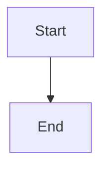

# Add UI Component

Insert just-the-docs UI components into Markdown page content.

## References

- [Full UI components reference](../../docs/just-the-docs-ui-components.md)
- [Config reference for callouts](../../docs/just-the-docs-config.md#callouts)

## Callouts

> **Prerequisite:** callout names must be declared in `_config.yml` under `callouts:`. If the callout name the user wants is not configured, use the [configure-site skill](../configure-site/SKILL.md) first.

### Single paragraph

```markdown
{: .note }
Text here.
```

### Custom title

```markdown
{: .note-title }
> My Title
>
> Text here.
```

### Multiple paragraphs

```markdown
{: .warning }
> First paragraph.
>
> Second paragraph.
```

Available callout names on this site (check `_config.yml` for current list):  
`note`, `warning`, `important`, `new`, `highlight`

## Tables

```markdown
| Column A | Column B |
| --- | --- |
| Value | Value |
```

Left/centre/right alignment:

```markdown
| Left | Centre | Right |
| :--- | :---: | ---: |
```

## Code blocks

````markdown
```python
# code here
```
````

Use lowercase language identifiers. Common: `yaml`, `bash`, `python`, `javascript`, `html`, `json`, `markdown`, `ruby`.

## Labels

```html
<span class="label label-blue">Label</span>
<span class="label label-green">Label</span>
<span class="label label-yellow">Label</span>
<span class="label label-red">Label</span>
<span class="label label-purple">Label</span>
```

## Buttons

```markdown
[Button text](#url){: .btn .btn-primary }
[Button text](#url){: .btn .btn-outline }
[Button text](#url){: .btn .btn-blue }
```

## Typography utilities

```markdown
Some text
{: .text-delta }

Some text
{: .text-small }
```

## Mermaid diagrams

> **Prerequisite:** `mermaid.version` must be set in `_config.yml`.

````markdown

````

## Procedure

1. Identify the component the user wants.
2. Check any prerequisites (callout config, Mermaid config).
3. Insert the component at the correct location in the page.
4. For callouts — verify the callout name exists in `_config.yml`; if not, prompt to configure it first.
